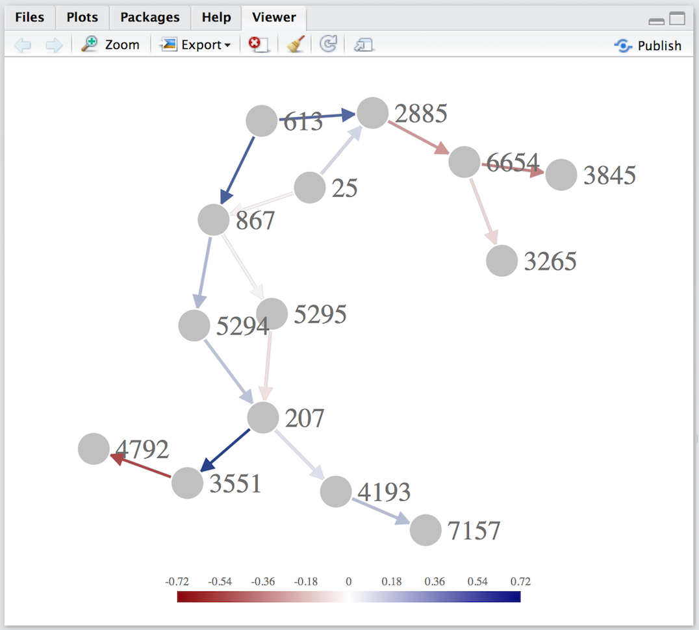
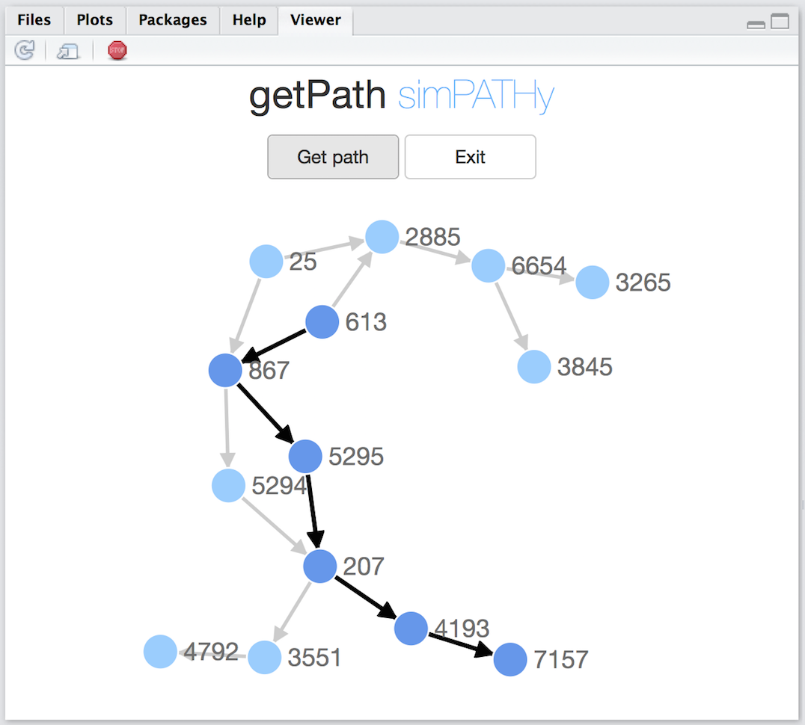
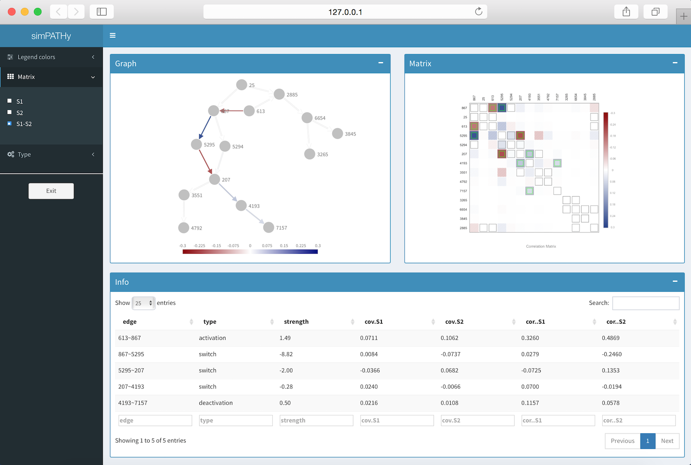

# Data preparation
We consider the acute lymphocytic leukemia dataset, included with the **simPATHy** package,  first published in [@chiaretti2005gene]. This dataset contains expression of 3405 genes in two conditions with  sample sizes $n_1=37$ and $n_2=41$.


```{r,echo=FALSE,include=FALSE}
library(simPATHy)
library(graph)
```
```{r,eval=FALSE}
library(simPATHy)
library(graph)
```
```{r}
data("chimera")
dim(chimera)
table(colnames(chimera))
```

The column names indicate the condition (1 or 2) of each sample. 

In this example, we restrict our attention to a subset of genes in this dataset, corresponding to genes participating in the KEGG’s [``Acute Myeloid Leukemia''](https://www.genome.jp/kegg-bin/show_pathway?hsa05221/) pathway. 

The graph that we consider in what follows is a directed acyclic graph derived manually from this pathway.
```{r}
graph<-gRbase::dag(~867:25+867:613+5295:867+5294:867+
207:5295+207:5294+4193:207+3551:207+
4792:3551+7157:4193+3265:6654+
3845:6654+6654:2885+2885:25+2885:613)
```

We  take the first condition of this dataset as a reference condition for our example and begin by estimating  the covariance matrix.

```{r}
genes<-graph::nodes(graph)
data<-t(chimera[genes,colnames(chimera)==1])
S<-cov(data) 
```

The  matrix `S` does not reflect conditional independence constraints imposed by the `graph`. To impose these structural constraints **simPATHy** provides a function `fitSgraph` for maximum likelihood estimation of covariance matrices in graphical models, for both Gaussian bayesian networks and Gaussian graphical models.

```{r}
S<-fitSgraph(graph,S)
round(S[1:5,1:5],3)
```

The package  also provides two plotting functions for  graphical models. The first `plotGraphNELD3`, focuses on the graphical structure, while the second one, `plotCorGraph`, focuses on the  correlation matrix. In both cases, the colors represent the strength of relation between nodes, where the user by setting the parameter `type` chooses whether to show the pairwise correlation coefficient (`type= "cor"`) or the partial correlation coefficient (`type= "pcor"`).

```{r, eval=FALSE}
plotGraphNELD3(graph,type = "cor",S1 = S)
```

<center>

</center>
<p></p>


```{r, fig.height=5, fig.width=7,  fig.align='center'}
plotCorGraph(S1 = S,type = "cor")
```

When the number of nodes is high and relations between them week, a user can  improve the visibility by adjusting the color range `colLim` (uncomment to launch).

```{r, fig.height=5, fig.width=7,  fig.align='center'}
lim<-round(max(abs(simPATHy:::riscala(S))[upper.tri(S)]),2)
#plotGraphNELD3(graph,type = "cor",S1 = S,colLim = c(-lim,lim))
plotCorGraph(S1 = S,type ="cor",colLim = c(-lim,lim))
```

Note that when an element  is outside of the `colLim`  interval,  it is colored gray in `plotCorGraph` and  represented as a dashed link in  `plotGraphNELD3`.

When plotting a correlation matrix, a user can also pass the associated graph to the `plotCorGraph` function to plot the adjacency matrix  over the correlation (or partial correlation) matrix.

```{r, fig.height=5, fig.width=7,  fig.align='center'}
plotCorGraph(S1 = S,type = "cor", graph = graph)
```

The zero elements of the adjacency matrix are represented as shaded squares, whereas non-zero elements are represented as squares with grey borderline. 

An important aspect is that the minimum input requirement for **simPATHy** is the graph. In absence of any other information, **simPATHy** sets the value of the corresponding reference condition covariance matrix to an estimate obtained from the Acute Lymphocytic Leukemia dataset. This is achieved by randomly selecting a gene set of the same cardinality as the order of the input graph (the number of vertices). 

Clearly, the parameter values obtained reflect the properties of the original dataset, and, in particular, represent starting values suitable for gene expression measurements. For more general situations, when the goal is to simulate data other than gene expression, the user might want to input a covariance matrix more representative of the desired type of data.

# Selecting a path in a graph
In **simPATHy**, a path is defined as a list (possibly of length 1) of edges of the graph. 

The following command specifies manually a path.

```{r }
path<-list(c("613","867"),c("867","5295"),c("5295","207"),
             c("207","4193"),c("4193","7157"))
```

Alternatively, the user can select the same path interactively by means of the function `getPathShiny`. The desired path is chosen by clicking sequentially on its edges, and pressing the \texttt{Get path} button to exit the interactive mode.

```{r, eval=FALSE }
path <- getPathShiny(graph)
```

<center>

</center>
<p></p>

```{r }
path
```

Finally, **simPATHy** provides a `generatePATH` function that finds the shortest path connecting two given nodes.

```{r, eval=FALSE }
path <- generatePath(graph,from="613",to="7157")
```

Note that **simPATHy** allows to simultaneously select more, possibly disjoint, paths to be dysregulated, as in the following command.

```{r, eval=FALSE }
path1 <- list(c("613","2885"), c("4193","7157"))
```


# Selecting parameters of dysregulation

By dysregulation we intend some multiplicative change of a subset of correlation coefficients. To specify the strength of dysregulation, the user is requested to provide a range of values for the possible dysregulation by fixing two positive parameters, `min` and `max`. The strength of dysregulation is sampled uniformly from the interval `[min, max]`: a value smaller than 1 represents deactivation (the relation between two variables is weakened), a value greater than 1 represents activation (the relation be- tween two variables is strengthened). A dysregulation range, is required for each edge in the path.

There are several types of signalling dysregulations and depending on the scenario that the user wants to simulate, different magnitudes should be applied in our model. In case of a mutation almost completely suppressing the expression of a gene or the level of a protein, the magnitude should be strong (and thus both values `min`, `max` would be close to zero). Otherwise, in stress conditions characterized by mild dysregulation of some (possibly many) genes, the magnitude may be moderate. 

In general, to test the sensitivity and specificity of gene set methods it would be reasonable to try different strengths of dysregulation. Moreover, values for `min` and `max` might depend on the type of data simulated. **simPATHy** provides default values `min=2`, `max=3` representing moderate dysregulations.

```{r}
min<-c(2,8,2,0.1,0.5)
max<-c(2,10,2,4,0.5)
```

In some applications it might be of interest to  change the direction of relation between two variables (the correlation coefficient changes sign). To allow for this possibility, `simPATHy` provides  `prob` parameter. `prob` is a number between 0 and 1, with 0 implying that the sign of the correlation coefficient  should be changed, and 1  implying that the sign should be left unaltered (default). Values between the two extremes allow for random sign switch: the sign is changed with probability `1-prob`. 

```{r}
prob<-c(1,0,0,0.5,1)
dys<-cbind(min,max,prob)
rownames(dys)<-sapply(path,paste,collapse = "~")
dys
```

Here, the correlation coefficient between variables `613` and `867` is to be  activated in the dysregulated condition, more precisely, multiplied by two, while  the relation between `4193` and `7157` is to be deactivated in the second condition (the correlation coefficient  multiplied by 0.5). On the other hand, the relation between `5295` and `207` is multiplied by two in the dysregulated condition and reversed, since `prob=0` forces a sign change. 

It is worth noting that the dysregulation specified by the user might be causing the modified correlation coefficient to lie outside the `(-1,1)` range. To avoid this problem and prevent excessively strong dysregulations, the absolute value of the dysregulated coefficient is controlled by **simPATHy** and set equal to
$$\min(0.9; 1.25\max \left\{|\rho_{u,v}|, u\neq v\right\}),$$ where $R=(\rho_{u,v})$ is the correlation matrix of the reference condition.

# Results
After choosing the sample sizes `n1` and `n2` for the two conditions  (default is 500), we have  set all the required parameters and can proceed  by calling the main function `simPATHy`. 

Note that the choice of the sample sizes depends on the use of the resulting simulated data. If simulated data are used to assess asymptotic properties of a method under study, sample size could be 1000 or higher. On the other hand, if one is interested in the finite sample properties, the sample size could be as small as 10.
 
```{r}
set.seed(123)
Result<-simPATHy(graph,path,S,min,max,prob)
```

The output is a `simPATHy` class object represented by a list of nine elements.

```{r}
class(Result)
names(Result)
```

The key element is the simulated `dataset` containing  `n1+n2` observations from two conditions--reference condition `cl1` and dysregulated condition `cl2`--sampled from  multivariate normal distributions with covariance matrices `Result$S1`  and `Result$S2`, respectively. 

```{r}
round(Result$dataset[c(1:3,501:503),1:5],3)
```

By default observations are sampled from zero mean normal distributions; however,  a user can specify different values for `mu1` and `mu2`.

Argument `param` allows to recover the dysregulation parameters.

```{r}
Result$param
```

The actual multiplicative constant applied to each path edge correlation coefficient is stored in argument `strength`.

```{r}
Result$strength
```

When the dysregulation of the initial (reference condition) covariance matrix leads to a matrix that is no longer positive definite,  the internal function `makePositiveDefinite` is automatically called. The `correction` argument signals the use of the correction giving the value $(0.1 − \lambda_\min)$.

```{r}
Result$correction
```

The summary of the output is provided by the function `easyLookDys`.
```{r eval = FALSE}
easyLookDys(Result)
```

```{r echo= FALSE}
knitr::kable(easyLookDys(Result))
```

To visualize differences in two conditions, **simPATHy** provides above mentioned plotting functions, i.e. `plotGraphNELD3` and `plotCorGraph`. In this case, both functions take, in addition to the graph, two covariance matrices corresponding to two conditions and  plot  the difference between them (uncomment to launch).

```{r, fig.height=5, fig.width=7,  fig.align='center'}
#plotGraphNELD3(graph,type = "cor",S1 = Result$S1, S2 = Result$S2, colLim = c(-0.4,0.4))
plotCorGraph(S1 = Result$S1, S2 = Result$S2, type = "cor",
graph = graph, path = Result$path,colLim = c(-0.4,0.4))
```

A user can examine  these plots in more detail by calling an interactive  `easyLookShiny` function.

```{r, eval=FALSE}
easyLookShiny(Result, graph)
```

<center>

</center>
<p></p>

The interactive dashboard contains three boxes (each of which can be hidden by clicking on the minus sign situated on top right) showing results of the three simPATHy functions: `plotGraphNELD3`, `plotCorMatrix` and `easyLookDys`.

Sliding menu, situated on the left, allows the user to set some of the graphical parameters:
<ul>
<li> *Legend colors*. Corresponds to the parameter `colLim` and allows to adjust the color limits representing correlation coefficients (matrix cells and graph edges). It is possible to set different values for positive coefficients (blue color) and negative coefficients (red color). In case of color limits that are too stringent, correlation coefficients that lie outside the specified range will be coloured grey.
<li> *Matrix*. Allows the user to choose which covariance matrix to represent: the reference condition, the dysregulated condition or their difference. In the later case, the differences between the two matrices `S1` and `S2` will be represented, with colours representing the strength of dysregulation. Green squares correspond to edges that have been dysregulated by **simPATHy**, while grey squares correspond to the remaining, unaltered graph edges. Shaded squares correspond to pairs of variables not connected by a graph edge, but whose associated partial correlation coefficient was affected by the perturbation.
<li> *Type*. Corresponds to the type parameter of the plotting functions and allows the user to choose whether to plot the correlation or the partial correlation matrix.
</ul>


# Use of the simulated data
As already stated, datasets simulated by **simPATHy** are especially suited for studying the performance of GSA tools that use the topology of the underlying biological network. 

For instance, [@topologyGSA] consider the test of equality of the two structured covariance matrices

$$H_0 : \Sigma_1 = \Sigma_2 \mbox{   vs   } H_1 : \Sigma_1 \neq \Sigma_2 $$

The `pathway.var.test` function implemented in the [**topologyGSA**](https://CRAN.R-project.org/package=topologyGSA) R package tests the equality of the concentration matrices of the two Gaussian graphical models, or in other words, the equality of the strength of the relations among genes on the pathway. The inputs are two experimental conditions, the graph and the significance level $\alpha$.

```{r, echo = T, results = 'hide'}
#library(topologyGSA)
#?pathway.var.test
y1<-Result$dataset[rownames(Result$dataset)=="cl1",]
y2<-Result$dataset[rownames(Result$dataset)=="cl2",]
alpha<-0.05
#pathway.var.test(y1, y2, dag = graph, alpha)
```

[**clipper**](http://bioconductor.org/packages/clipper/), the approach implemented in [@clipper], goes a step further and identifies the paths within a pathway that differ the most between the two experimental conditions.

```{r}
library(clipper)
#?clipper
expr<-t(Result$dataset)
classes<-as.numeric(gsub("cl","",colnames(expr)))
clipped<-clipper(expr,classes,graph)
clipped
```

# Note
**simPATHy** depends on some BioC packages. 

The command `install.packages("simPATHy")` will not install the necessary **BioC** packages that would have to be installed separately. For this reason we suggest to use the command `biocLite("simPATHy")`: it will install all the dependencies from both **CRAN** and **BioC**.


#References

